# 哈萨克斯坦 Tele2 / Altel 在线申请 eSIM 及 0 月租套餐教程

> 本教程手把手教你通过手机 App 在线申请哈萨克斯坦 Tele2 eSIM，并在激活后将套餐更改为 **0 月租** 的基础套餐（Базовый），适合需要长期保号、接收短信、注册海外服务的用户。

---

## 目录

- [前置说明](#前置说明)
- [准备工作](#准备工作)
- [第一部分：Tele2 App 在线申请 eSIM](#第一部分tele2-app-在线申请-esim)
  - [步骤 1：下载 App 并选择语言](#步骤-1下载-app-并选择语言)
  - [步骤 2：进入「成为客户」页面](#步骤-2进入成为客户页面)
  - [步骤 3：选择购买号码](#步骤-3选择购买号码)
  - [步骤 4：挑选免费号码](#步骤-4挑选免费号码)
  - [步骤 5：选择 SIM 卡类型](#步骤-5选择-sim-卡类型)
  - [步骤 6：选择 eSIM](#步骤-6选择-esim)
  - [步骤 7：选择套餐](#步骤-7选择套餐)
  - [步骤 8：任选一个付费套餐](#步骤-8任选一个付费套餐)
  - [步骤 9：选择付款方式](#步骤-9选择付款方式)
  - [步骤 10：选择「充值余额」而非「支付套餐费」](#步骤-10选择充值余额而非支付套餐费)
  - [步骤 11：填写联系号码](#步骤-11填写联系号码)
  - [步骤 12：选择外国公民护照认证](#步骤-12选择外国公民护照认证)
  - [步骤 13：扫描护照](#步骤-13扫描护照)
  - [步骤 14：文档验证通过](#步骤-14文档验证通过)
  - [步骤 15：银行卡支付](#步骤-15银行卡支付)
  - [步骤 16：查看订单状态](#步骤-16查看订单状态)
- [第二部分：Altel App 更改 0 月租套餐](#第二部分altel-app-更改-0-月租套餐)
  - [步骤 1：打开 Altel App 首页](#步骤-1打开-altel-app-首页)
  - [步骤 2：进入「我的套餐」](#步骤-2进入我的套餐)
  - [步骤 3：选择「基础套餐」（0 月租）](#步骤-3选择基础套餐0-月租)
  - [步骤 4：套餐开通成功](#步骤-4套餐开通成功)
  - [步骤 5：确认 0 月租套餐已生效](#步骤-5确认-0-月租套餐已生效)
- [常见问题 FAQ](#常见问题-faq)
- [注意事项](#注意事项)

---

## 前置说明

- **Tele2 与 Altel 的关系**：两者同属哈萨克斯坦国家电信公司 Kazakhtelecom 旗下，网络互通。Tele2 号码可以直接用 Altel App 登录管理，反之亦然。
- **为什么要先选付费套餐再改 0 月租**：新开户时系统不允许直接选 0 月租套餐，必须先选一个付费套餐完成开户，激活后再在 App 内免费更换为基础套餐（Базовый），无月租费。
- **0 月租套餐说明**：Базовый（基础套餐）无月费，哈萨克斯坦境内拨打移动电话 18 ₸/分钟，首次开通赠送 300 MB 流量。适合保号、收验证码。

## 准备工作

| 项目 | 说明 |
|------|------|
| 支持 eSIM 的手机 | iPhone XS 及以上、Google Pixel 系列、三星 Galaxy 系列等；App 会自动检测 |
| 护照 | 外国公民需用护照进行实名认证 |
| 哈萨克斯坦银行卡 | **必须**是哈萨克斯坦本地发行的 VISA / MasterCard 银行卡，境外卡无法支付 |
| Tele2 App | 在 App Store / Google Play 搜索 `Tele2 Kazakhstan` 下载 |
| Altel App | 在 App Store / Google Play 搜索 `Altel` 下载（用于后续改套餐） |

---

## 第一部分：Tele2 App 在线申请 eSIM

### 步骤 1：下载 App 并选择语言

打开 Tele2 App，首次启动会让你选择界面语言：

- **Қазақша** — 哈萨克语
- **Русский** — 俄语（推荐选这个，通用性更强）

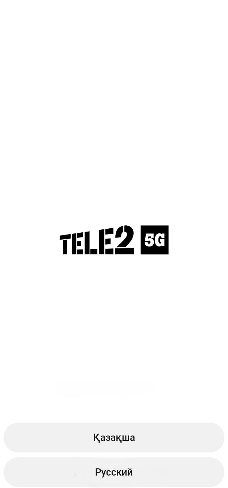

### 步骤 2：进入「成为客户」页面

进入登录页（Вход）后，**不要**在上方输入手机号登录。直接点击下方菜单中的 **«Стать клиентом»**（成为客户）。

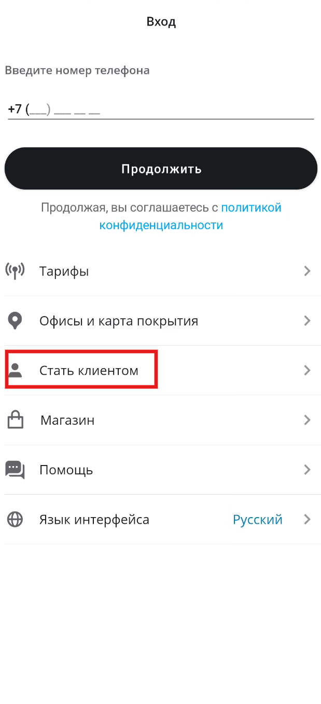

### 步骤 3：选择购买号码

在「成为客户」页面，顶部会显示当前城市（如 Алматы 阿拉木图，可点击修改）。

页面有两个选项：

- **Покупка номера**（购买号码）— 选一个新号码
- **Перенос номера**（号码转移）— 从其他运营商携号转网

我们要新办号码，点击 **Покупка номера** 下方的 **«Выбрать»**（选择）按钮。

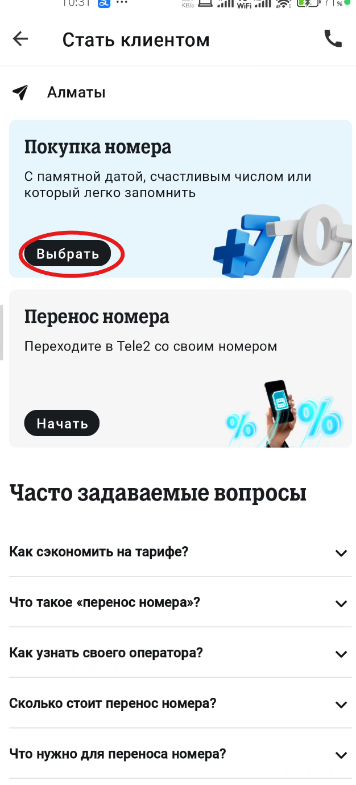

### 步骤 4：挑选免费号码

进入选号页面：

1. 在顶部搜索框输入任意数字（如 `666`）来筛选号码
2. 点击 **«Бесплатные»**（免费）标签，只显示免费号码
3. 从列表中挑选一个你喜欢的号码，例如 `+7 (707) 266 63 87`

> 也有付费号码（4 500 ₸、14 500 ₸ 等），按需选择即可。

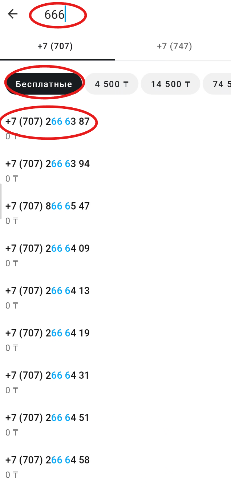

### 步骤 5：选择 SIM 卡类型

选好号码后进入「Оформление」（办理）页面，确认号码无误后，点击 **«SIM-карта»**（SIM 卡）这一项，副标题显示 «eSIM или пластиковая»（eSIM 或塑料卡）。

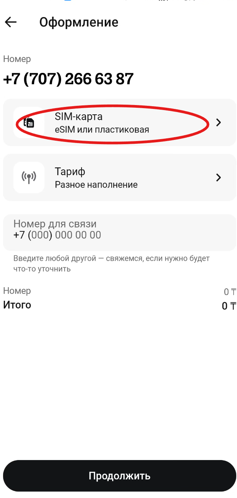

### 步骤 6：选择 eSIM

在 SIM 卡选择页面，有两个选项：

- **Пластиковая**（塑料卡）— 物理 SIM 卡，快递配送
- **eSIM** — 虚拟卡，在线安装到手机

选择 **eSIM**。下方会显示绿色对勾 **«Телефон поддерживает eSIM»**（手机支持 eSIM），确认后点击底部 **«Готово»**（完成）。

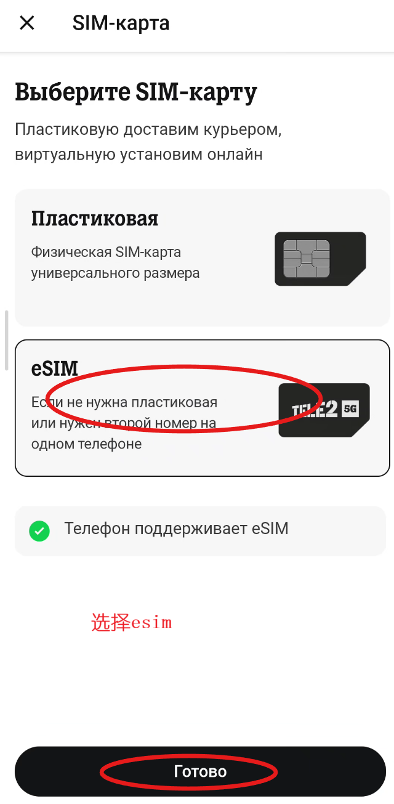

### 步骤 7：选择套餐

回到办理页面，SIM 卡已显示为 eSIM。接下来点击 **«Тариф»**（套餐）这一项。

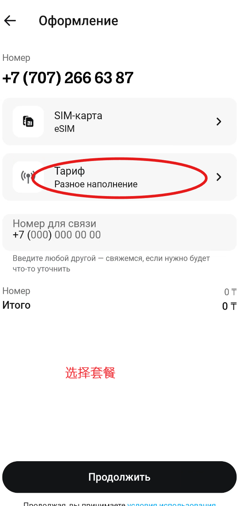

### 步骤 8：任选一个付费套餐

套餐列表中有多个付费套餐可选，例如：

| 套餐 | 内容 | 月费 |
|------|------|------|
| Выгодный Promo | 30 GB + 100 分钟 | 2 590 ₸/月 |
| Семейный 3 | 无限流量 + 400 分钟 | 6 745 ₸/月 |
| Выгодный Pro | 25 GB + 150 分钟 | 4 632 ₸/月 |

> ⚠️ **重要**：这里**随便选一个最便宜的付费套餐**即可（如 Выгодный Promo），因为开户完成后我们会立刻改成 0 月租套餐。选好后点击底部 **«Хочу этот тариф»**（我要这个套餐）。

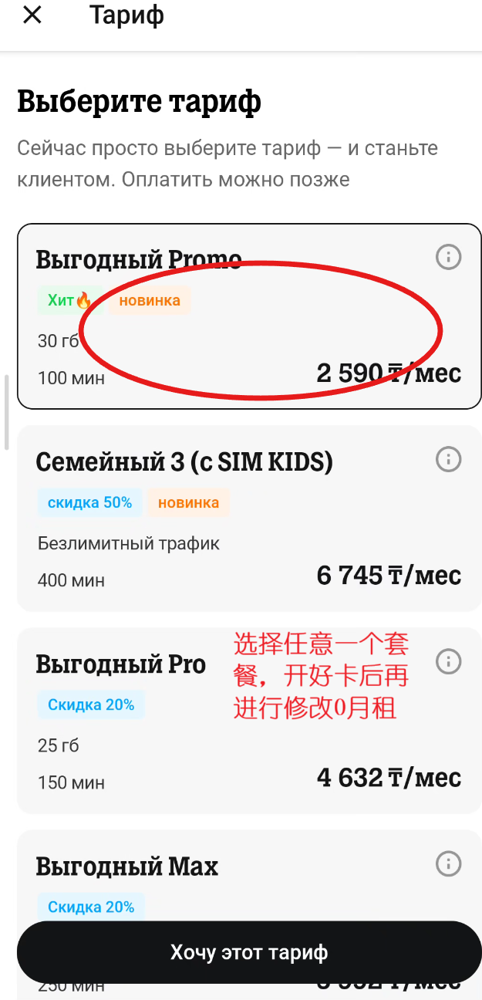

### 步骤 9：选择付款方式

回到办理页面，点击 **«Оплата»**（付款），弹出付款方式选择：

- **Оплатить с Kaspi.kz** — Kaspi 钱包支付
- **Оплата картой** — 银行卡支付

选择 **«Оплата картой»**（银行卡支付），然后点击 **«Готово»**。

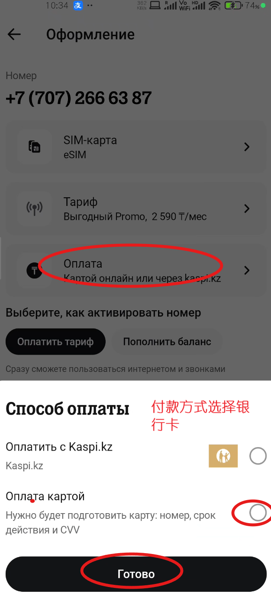

### 步骤 10：选择「充值余额」而非「支付套餐费」

办理页面下方有两个激活方式选项：

- **Оплатить тариф**（支付套餐费）— 直接扣除一个月套餐费
- **Пополнить баланс**（充值余额）— 只把钱充到余额，不扣套餐费

> ⚠️ **关键步骤**：一定要选 **«Пополнить баланс»**（充值余额）！因为接下来要改成 0 月租套餐，如果先付了套餐费就浪费了。选了这个之后，充的钱会留在余额里，改完 0 月租后可以用来打电话、发短信。

此时底部显示：号码 0 ₸，套餐 2 590 ₸，总计 2 590 ₸。

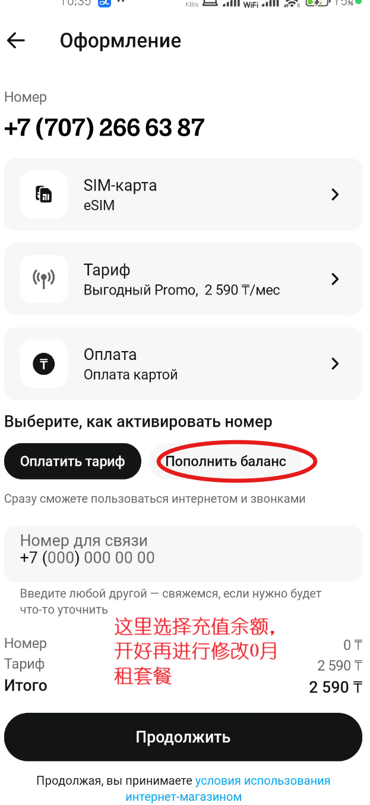

### 步骤 11：填写联系号码

在 **«Номер для связи»**（联系号码）栏填写一个能联系到你的备用手机号（用于客服沟通），例如 `+7 (707) 121 23 13`，然后点击底部 **«Продолжить»**（继续）。

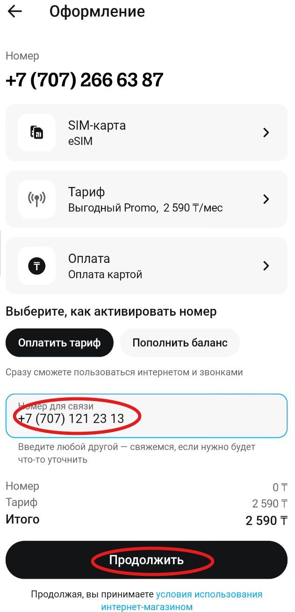

### 步骤 12：选择外国公民护照认证

进入「Регистрация номера」（号码注册）页面，有两个认证选项：

- **Для граждан РК и с ВНЖ** — 哈萨克斯坦公民及永久居民（需要 ИНН 税号）
- **Для иностранных граждан** — 外国公民（需要护照 паспорт）

作为中国用户，选择 **«Для иностранных граждан»**（外国公民）。

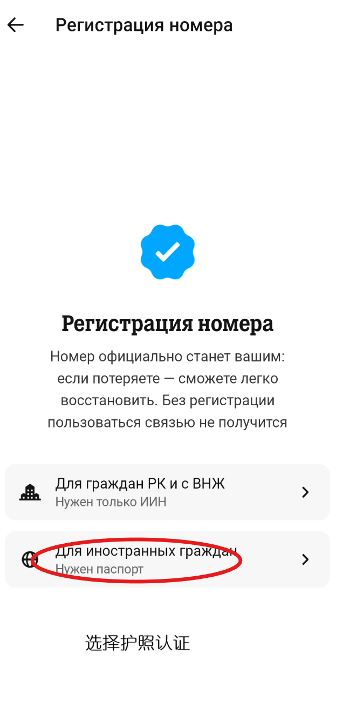

### 步骤 13：扫描护照

进入护照扫描页面（Отсканируйте паспорт），提示 «Фото должно быть чётким и без бликов»（照片必须清晰、无反光）。点击底部 **«Начать»**（开始），按照提示用手机摄像头扫描护照信息页。

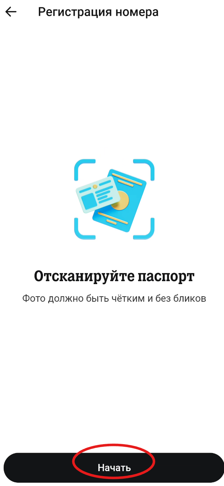

### 步骤 14：文档验证通过

扫描成功后，系统显示 **«С документами всё хорошо»**（文件没问题），提示 «Осталось оплатить за выбранный номер»（剩下支付所选号码的费用）。点击底部 **«Оплатить»**（支付）。

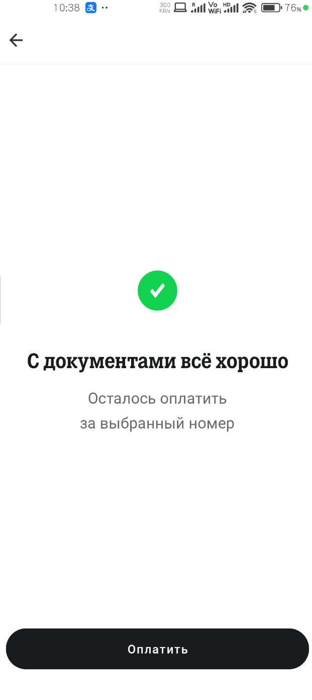

### 步骤 15：银行卡支付

进入支付页面（Оплата），确认信息：

- 电话号码：`8 (707) 266 63 87`
- 支付金额：`2 590.00 KZT`
- 支持 VISA / MasterCard

输入银行卡信息：
- **Введите номер карты** — 卡号
- **ММ/ГГ** — 有效期（月/年）
- **cvv/cvc** — 安全码

> ⚠️ **必须使用哈萨克斯坦本地发行的银行卡**，境外卡（包括中国的 VISA/MasterCard）无法完成支付。底部由 PROCESSING.kz 处理，支持 Verified by VISA 和 MasterCard SecureCode。

输入完成后点击 **«Оплатить»**（支付）。

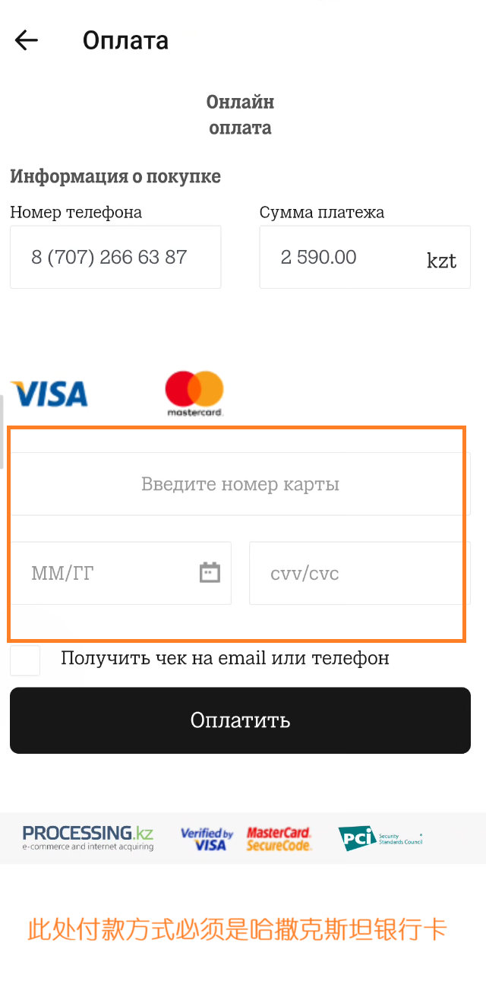

### 步骤 16：查看订单状态

支付完成后，回到「Стать клиентом」（成为客户）页面，可以看到 **«Заказ по покупке номера»**（号码购买订单），状态显示 **«Ожидает оплаты»**（等待支付）或已支付。点击可查看订单详情，eSIM 会在支付成功后自动下发到手机。

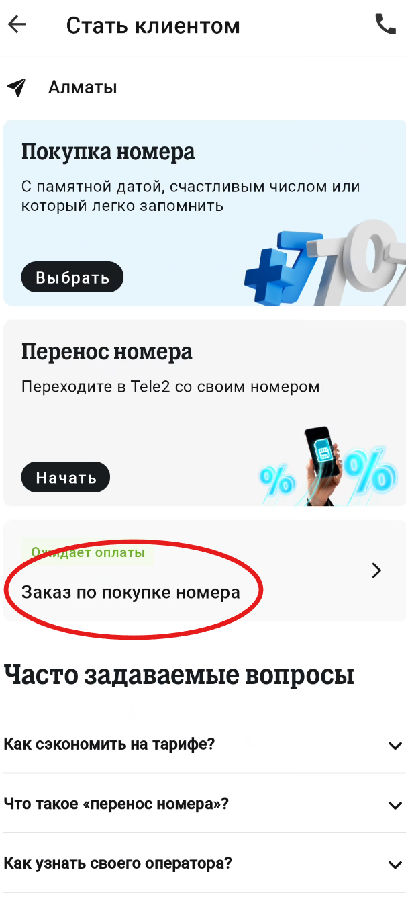

> eSIM 下发后，手机会弹出安装提示，按照引导完成安装即可。安装完成后号码即可正常使用。

---

## 第二部分：Altel App 更改 0 月租套餐

eSIM 激活后，我们用 **Altel App** 登录同一个号码，将套餐更换为 0 月租的基础套餐。

> Tele2 和 Altel 账号互通，用你的 Tele2 手机号直接登录 Altel App 即可。

### 步骤 1：打开 Altel App 首页

登录 Altel App 后进入首页（Главная）：

- 顶部显示你的号码和余额（Баланс）
- 当前套餐显示为开户时选的付费套餐（如 Жеке+）
- 中间区域有三个入口：**Тоқтама**（停机保号）、**Мой тариф**（我的套餐）、**Магазин**（商店）

点击 **«Мой тариф»**（我的套餐）。

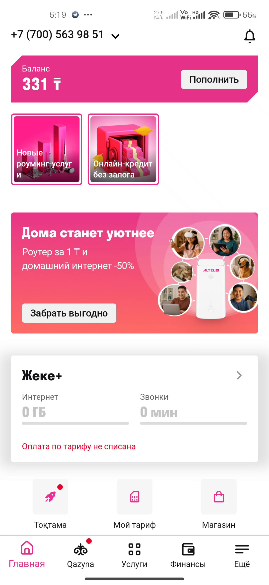

### 步骤 2：进入「我的套餐」

在套餐页面，可以看到当前套餐信息和红色提示（需要支付套餐费才能使用通信服务）。页面有四个功能按钮：

- **Сменить тариф** — 更换套餐
- **Роуминг** — 漫游
- **Детализация** — 详单
- **Мои услуги** — 我的服务

点击 **«Сменить тариф»**（更换套餐）。

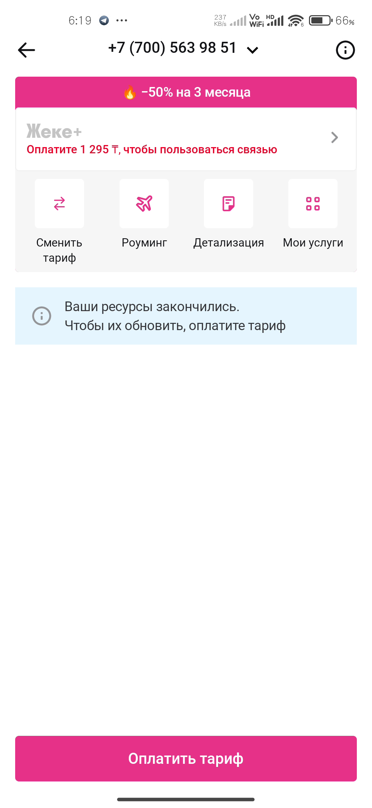

### 步骤 3：选择「基础套餐」（0 月租）

进入「Выбор тарифа」（选择套餐）页面，在「Для себя」（个人）标签下，可以看到：

- **Арнау** — 自定义套餐，от 3 600 ₸/月
- **Базовый** — 基础套餐，标注 **«без абонентской оплаты»**（**无月租费**），首次开通赠送 300 MB 流量

选择 **Базовый**（基础套餐），点击进入详情后确认开通。

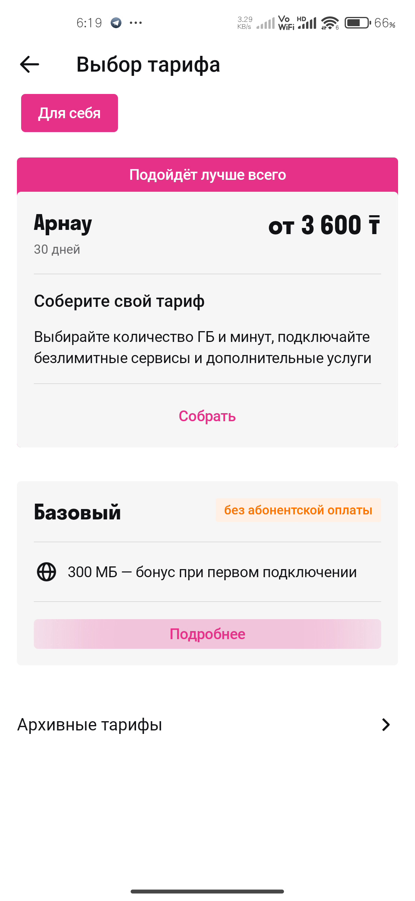

### 步骤 4：套餐开通成功

页面显示 **«Тариф подключен»**（套餐已开通），表示 0 月租套餐更换成功。页面可能会推荐开启自动充值获赠 5 GB，不需要的话直接点击底部 **«Вернуться в Мой тариф»**（返回我的套餐）即可。

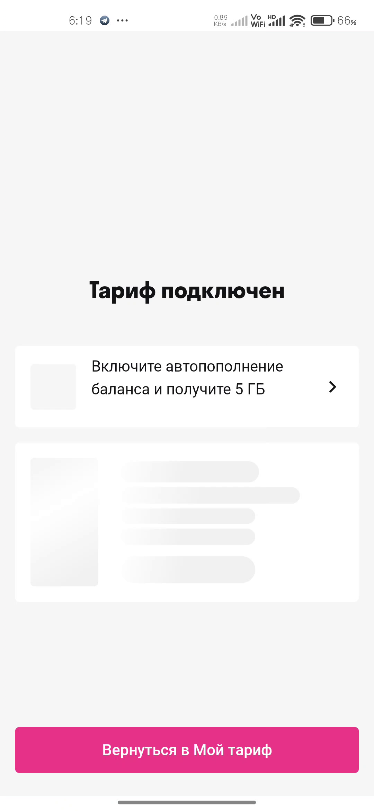

### 步骤 5：确认 0 月租套餐已生效

返回首页，套餐区域已显示为 **«Базовый»**（基础套餐），并标注 «На все мобильные по РК 18 ₸/мин»（哈萨克斯坦境内拨打移动电话 18 坚戈/分钟）。余额保持不变，**不再有月费扣除**。

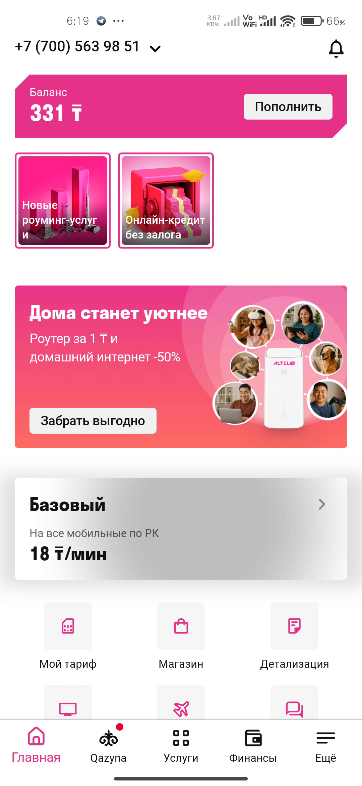

🎉 至此，你已经成功办理了哈萨克斯坦 eSIM 并切换到 0 月租套餐！

---

## 常见问题 FAQ

**Q1：没有哈萨克斯坦银行卡怎么办？**
A：可以找在哈萨克斯坦的朋友代付，或在淘宝/闲鱼等平台寻找代充服务。注意核实对方信誉，避免诈骗。

**Q2：eSIM 安装失败怎么办？**
A：确保手机支持 eSIM 且已连接网络。如果 App 检测不到 eSIM 支持，可能是手机型号不兼容或运营商锁限制。可尝试重启手机后重新进入订单页面下发 eSIM。

**Q3：0 月租套餐能在中国使用吗？**
A：可以漫游，但漫游费用较高（具体费率需在 App 内查询 Роуминг 漫游页面）。0 月租套餐主要适合保号和接收短信验证码。

**Q4：号码多久会被回收？**
A：哈萨克斯坦运营商通常会在号码长期无活动（约 90-180 天无充值/无使用）后回收。建议偶尔充值或发送短信保持活跃。

**Q5：可以用这个号码注册哪些服务？**
A：可用于注册 Telegram、WhatsApp、Google、微信等支持 +7 区号的海外服务。部分平台可能对虚拟运营商号段有限制。

**Q6：Tele2 和 Altel 用哪个 App 都行吗？**
A：是的，两者同属 Kazakhtelecom，账号互通。申请 eSIM 用 Tele2 App，改 0 月租套餐两个 App 都可以操作，本教程以 Altel App 为例。

---

## 注意事项

1. **护照扫描**：确保护照信息页清晰、无反光、无遮挡，否则认证可能失败需要重新扫描。
2. **银行卡**：务必使用哈萨克斯坦本地银行卡，境外卡支付会失败。
3. **先充余额不付套餐费**：开户时一定要选「Пополнить баланс」（充值余额），避免白扣一个月套餐费。
4. **及时改套餐**：开户后尽快改成 0 月租套餐，避免到了扣费日被扣除付费套餐月费。
5. **余额有效期**：充值的余额有使用有效期，长期不用可能会被冻结，建议定期查看。
6. **漫游资费**：在哈萨克斯坦境外使用时注意漫游费用，建议关闭数据漫游，仅用于接收短信。

---

*本教程基于 2025 年 11 月的 App 界面编写，运营商可能随时调整界面和套餐政策，请以实际 App 显示为准。*
