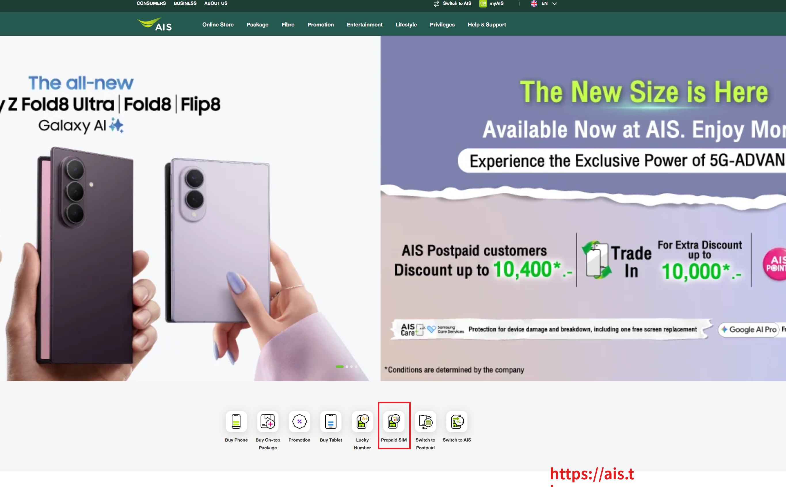
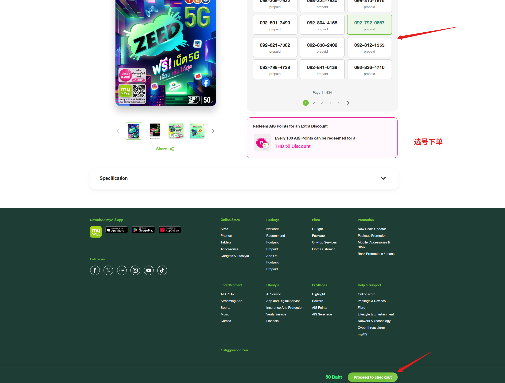
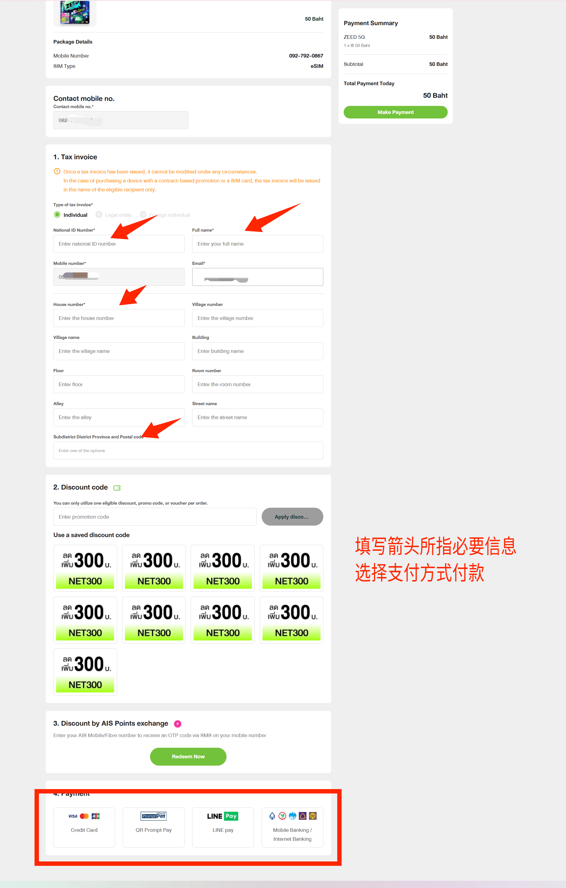
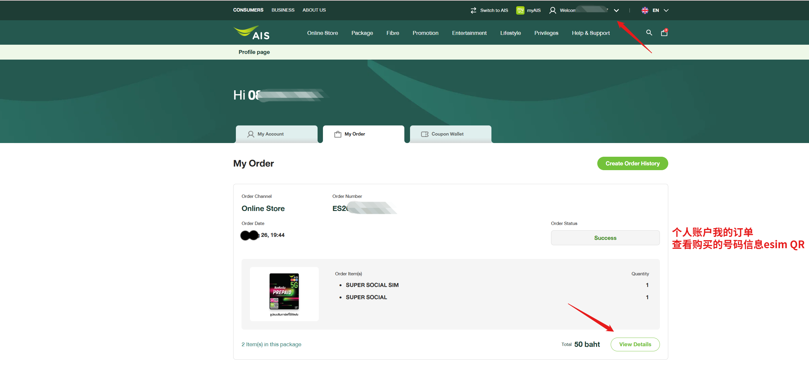
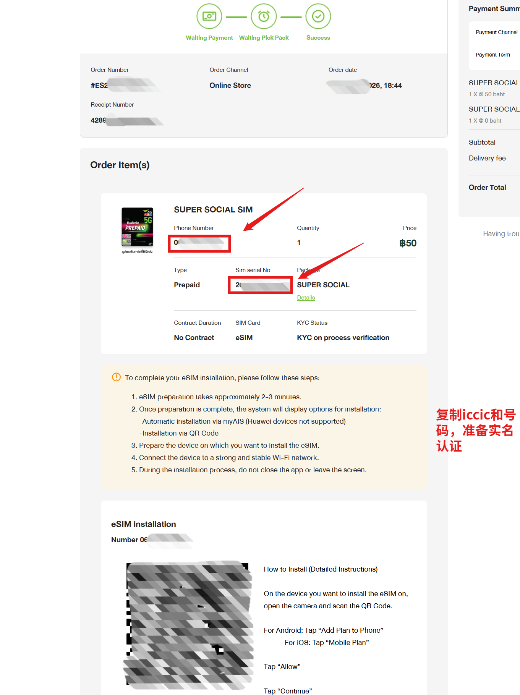
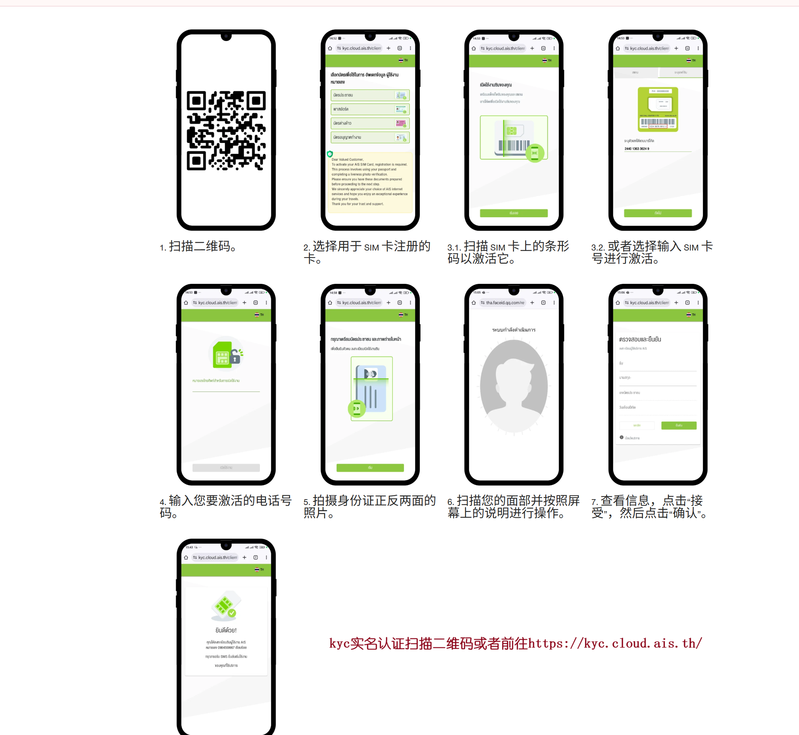

# 泰国 AIS 在线申请 eSIM 开户教程

> 本教程手把手教你通过泰国 AIS 官网在线购买预付 eSIM，完成 KYC 实名认证后即可激活使用，适合需要泰国手机号、长期保号、注册海外服务或赴泰旅游的用户。

---

## ⚡ 不想自己折腾？直接买成品

如果你嫌自助申请太麻烦，或者想即买即用，可以直接购买已开好的成品 eSIM：

👉 **[点击购买成品泰国 AIS eSIM（已激活）](https://buyesim.pp.ua)**

成品卡优势：
- 无需自己注册、KYC 认证
- 已完成实名认证，到手扫码即用
- 提供 eSIM 二维码 / 激活码

---

## 目录

- [前置说明](#前置说明)
- [准备工作](#准备工作)
- [第一部分：AIS 官网购买 eSIM](#第一部分ais-官网购买-esim)
  - [步骤 1：打开 AIS 官网，进入预付 SIM 卡](#步骤-1打开-ais-官网进入预付-sim-卡)
  - [步骤 2：选择 50 泰铢套餐](#步骤-2选择-50-泰铢套餐)
  - [步骤 3：挑选号码并结账](#步骤-3挑选号码并结账)
  - [步骤 4：填写信息并支付](#步骤-4填写信息并支付)
- [第二部分：获取 eSIM 信息](#第二部分获取-esim-信息)
  - [步骤 5：查看我的订单](#步骤-5查看我的订单)
  - [步骤 6：订单详情 — 获取手机号、ICCID 和 eSIM 二维码](#步骤-6订单详情--获取手机号iccid-和-esim-二维码)
- [第三部分：KYC 实名认证与激活](#第三部分kyc-实名认证与激活)
  - [步骤 7：KYC 实名认证（护照 + 人脸）](#步骤-7kyc-实名认证护照--人脸)
- [eSIM 安装方法](#esim-安装方法)
- [常见问题 FAQ](#常见问题-faq)
- [注意事项](#注意事项)

---

## 前置说明

- **AIS 是什么**：AIS（Advanced Info Service）是泰国最大的移动通信运营商，网络覆盖最好，5G 信号强。
- **预付卡（Prepaid）**：本教程购买的是预付套餐，先付费后使用，无合约绑定，用完可充值，不充值则到期停用，适合保号。
- **eSIM 支持**：购买时 SIM 类型选择 eSIM，支付后系统自动生成 eSIM 二维码，扫码安装到手机即可。
- **KYC 认证**：泰国法律要求所有 SIM 卡必须完成实名认证，外国人使用护照认证，未完成 KYC 的号码会被限制使用。

## 准备工作

| 项目 | 说明 |
|------|------|
| 支持 eSIM 的手机 | iPhone XS 及以上、Google Pixel 系列、三星 Galaxy 系列等 |
| 护照 | 外国人 KYC 实名认证用 |
| 邮箱 | 接收订单确认和 eSIM 信息 |
| 支付方式 | 国际信用卡（VISA/MasterCard）、PromptPay、LINE Pay、泰国网银 |
| 网络 | 稳定的 Wi-Fi 或移动数据，用于扫码和人脸认证 |

---

## 第一部分：AIS 官网购买 eSIM

### 步骤 1：打开 AIS 官网，进入预付 SIM 卡

打开 AIS 泰国官网：**https://www.ais.th/**

在首页中部的功能图标区，找到并点击 **«Prepaid SIM»**（预付 SIM 卡）图标。

> 右上角可以将语言切换为英文（EN），方便操作。

### 步骤 2：选择 50 泰铢套餐

进入预付 SIM 卡列表页面（Prepaid SIM cards），共有 25 款产品可选。

> 💡 **省钱技巧**：如果只是为了保号或注册账号，买**最便宜的 50 泰铢**套餐即可，例如：
> - **ZEED 5G** — 50 Baht
> - **SUPER SOCIAL SIM** — 50 Baht
> - **MYANMAR_MINGALA SIM** — 50 Baht
> - **THE ONE SIM** — 50 Baht

选好后点击套餐下方的 **«Buy now»**（立即购买）。

### 步骤 3：挑选号码并结账

进入商品详情页：

- 左侧显示套餐封面和缩略图
- 右侧是**号码列表**，每个号码下方标注 `prepaid`，点击选中你喜欢的号码
- 底部显示价格 `50 Baht`

选好号码后，点击右下角绿色按钮 **«Proceed to checkout»**（去结账）。

### 步骤 4：填写信息并支付

进入结账页面，需要填写以下内容：

**① Package Details（套餐信息）**
- 确认套餐名称、手机号、SIM 类型为 **eSIM**

**② Contact mobile no.（联系电话）**
- 填写一个能联系到你的手机号（可填国内号码）

**③ Tax invoice（发票信息）**
- Type of tax invoice：外国人选 **«Foreign individual»**（外国个人），或选 Individual
- **National ID Number**：填写护照号
- **Full name**：姓名（与护照一致，拼音）
- **Mobile number**：手机号
- **Email**：邮箱（用于接收订单和 eSIM 信息）
- **House number / Village / Street / Subdistrict District Province and Postal code**：地址信息，可填酒店或任意泰国地址

**④ Discount code（优惠码）**
- 如有优惠码可输入（如 NET300），点击 Apply discount 应用

**⑤ Payment（支付方式）**
- **Credit Card** — 信用卡（VISA/MasterCard，推荐，支持国际卡）
- **QR PromptPay** — 泰国扫码支付
- **LINE Pay** — LINE 钱包
- **Mobile Banking / Internet Banking** — 泰国网银

右上角 Payment Summary 确认金额后，点击绿色按钮 **«Make Payment»** 完成支付。

---

## 第二部分：获取 eSIM 信息

### 步骤 5：查看我的订单

支付成功后，点击右上角账户头像进入 **Profile page（个人中心）**，切换到 **«My Order»**（我的订单）标签页。

可以看到刚下的订单，Order Status 显示 **«Success»**（成功）。点击订单右下角的 **«View Details»**（查看详情）。

### 步骤 6：订单详情 — 获取手机号、ICCID 和 eSIM 二维码

在订单详情页，可以看到关键信息：

- **Phone Number**：你的泰国手机号（如 092-xxx-xxxx）
- **SIM serial No**：ICCID 卡号（**重要，KYC 认证时需要**）
- **Type**：Prepaid（预付）
- **SIM Card**：eSIM
- **KYC Status**：`KYC on process verification`（待实名认证）

页面下方 **«eSIM installation»** 区域会显示 eSIM 二维码。

> ⚠️ **重要**：先**复制保存手机号和 ICCID（SIM serial No）**，下一步 KYC 认证需要用到。
>
> eSIM 准备大约需要 2-3 分钟，准备好后会显示安装选项。

---

## 第三部分：KYC 实名认证与激活

### 步骤 7：KYC 实名认证（护照 + 人脸）

泰国法律要求 SIM 卡必须实名登记。用手机浏览器访问 KYC 认证页面：

🔗 **https://kyc.cloud.ais.th/**

或扫描订单页面提供的 KYC 二维码。按照以下步骤操作：

1. **扫描二维码** — 打开 KYC 页面
2. **选择用于 SIM 卡注册的卡** — 选择你购买的套餐对应的卡
3. **激活 SIM 卡** — 扫描 SIM 卡条形码，或手动输入 **ICCID（SIM serial No）** 激活
4. **输入电话号码** — 填写你购买的泰国手机号
5. **拍摄证件照片** — 外国人拍摄**护照信息页**正反面（或按提示要求）
6. **面部扫描** — 按照屏幕提示进行人脸识别，确保光线充足、面部无遮挡
7. **确认信息** — 核对填写的信息，点击 **«接受»（Accept）**，然后点击 **«确认»（Confirm）**
8. **完成** — 页面显示认证成功，KYC 状态更新为已验证

> KYC 认证通过后，号码即可正常使用。如果认证失败，按提示重新拍摄证件或人脸即可。

---

## eSIM 安装方法

### 方法一：扫码安装（推荐）

1. 在订单详情页找到 eSIM 二维码
2. 用要安装 eSIM 的手机打开相机，对准二维码
3. **iPhone**：弹出「移动数据套餐」提示，点击 → 「添加移动数据套餐」→ 按引导完成
4. **Android**：弹出「添加套餐到手机」提示，点击 → 按引导完成

### 方法二：myAIS App 自动安装

1. 在手机上下载 **myAIS** App（App Store / Google Play）
2. 登录你的 AIS 账号
3. 在 App 内找到 eSIM 安装入口，按提示自动安装
4. ⚠️ 华为设备不支持 myAIS 自动安装，请用扫码方式

### 安装注意事项

- 安装过程中**不要关闭 App 或离开页面**
- 确保手机连接**稳定的 Wi-Fi**
- eSIM 准备需要约 2-3 分钟，请耐心等待
- 安装完成后，在手机设置 → 蜂窝网络中确认 eSIM 已激活

---

## 常见问题 FAQ

**Q1：没有信用卡怎么办？**
A：可以使用 LINE Pay 或找有泰国银行卡的朋友代付，也可以直接购买成品 eSIM 👉 [点击购买](https://buyesim.pp.ua)。

**Q2：50 泰铢套餐包含什么？**
A：不同套餐内容不同，一般包含一定流量和通话时长，具体以套餐详情为准。套餐用完后可充值继续使用。

**Q3：KYC 认证用护照还是身份证？**
A：外国人必须用**护照**认证，泰国公民用身份证。确保护照信息清晰、在有效期内。

**Q4：eSIM 安装失败怎么办？**
A：确保手机支持 eSIM 且已连接网络。可尝试重启手机后重新扫码，或通过 myAIS App 安装。华为手机不支持 myAIS 自动安装，请用扫码方式。

**Q5：号码有效期多久？**
A：预付卡有有效期，初始套餐一般有一定使用期限（如 30 天），到期后需充值才能继续使用。长期不充值会被回收，建议定期充值保号。

**Q6：可以在中国使用这个号码吗？**
A：可以漫游，但漫游费用较高。AIS 支持国际漫游，具体费率可在 myAIS App 内查询。主要适合保号、接收短信验证码。

**Q7：可以注册哪些服务？**
A：可用于注册 LINE、WhatsApp、Telegram、Google、微信等支持 +66 区号的服务。

---

## 注意事项

1. **KYC 必做**：必须完成实名认证才能正常使用，未认证号码会被限制通话和数据。
2. **护照拍照**：确保护照信息页清晰、无反光、无遮挡，人脸认证时光线充足。
3. **保存 ICCID**：订单详情页的 SIM serial No（ICCID）很重要，KYC 激活时需要，建议截图保存。
4. **eSIM 二维码**：二维码是安装 eSIM 的关键，请勿泄露给他人，一个二维码对应一个 eSIM。
5. **充值保号**：预付卡到期前及时充值，避免号码被回收。
6. **漫游资费**：在泰国境外使用注意漫游费用，建议关闭数据漫游，仅用于接收短信。
7. **地址填写**：结账时的泰国地址可填酒店地址或任意有效地址，不影响 eSIM 使用。

---

*本教程基于 2026 年 AIS 官网界面编写，运营商可能随时调整界面和套餐政策，请以实际官网显示为准。*
